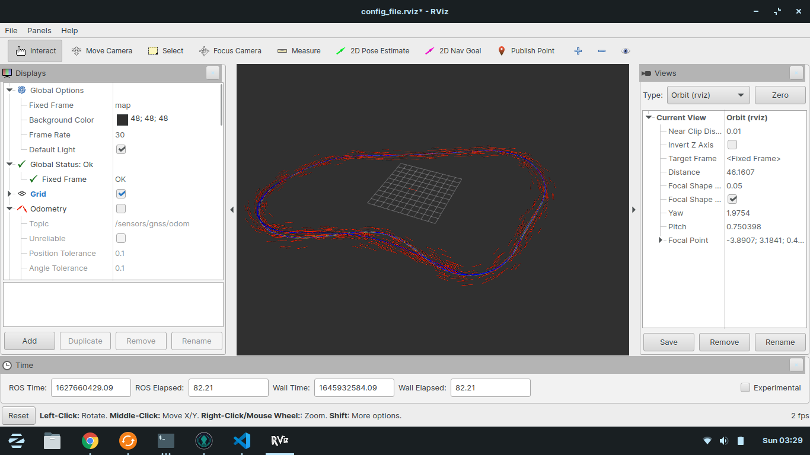

## Crover Localization challenge

## Observations:

The following observations can be made initially with respect to the given data (data.bag file).

- GNSS sensor messages:
    - Type: nav_msgs/Odometry
    - Frequency: ~10Hz
    - Does not provide orientation data
- Wheel Odometry messages:
    - Type: nav_msgs/Odometry
    - Frequency: ~50Hz
    - Likely inaccurate Pose data but accurate Twist (velocity) data 

- cannot visualize GNSS and wheel odom at the same time( Messages are too old error) FIXED: set use_sim_time=true

## Approach:

The problem requires combining two different odometry information to output a predicted position and orientation of the car. 
This can be done mostly by a filter, a kalman-filter or an EKF is most likely to give the best estimates. However, this will take quite 
a bit of research as it is not something that I am familar with at this moment. 


UPDATE:
The EKF algorithm was succesfully implemented and provided good results. The EKF implenetation was largely based on the amazing explaination and tutorial
by the author of [this post](https://automaticaddison.com/extended-kalman-filter-ekf-with-python-code-example/)

Although it is not a one-to-one implementation, the intuition remains the same. The position obtained from the GNSS sensor is considered to be the "actual measurement" and the wheel encoder data is considered to be the "measurement model" for calculating the "measurement residual" for the optimal state estimate in the update step of the EKF.

Understanding EKF certainly took the longest time. There are a lot of material out there for different use cases and to understand how to implement a KF or an EKF with the given data was certainly a challenge. Having experience with State-Space did of course help.

The initial idea was to explore the possibility of the already implemented EKF ROS package,[robot_pose_ekf](http://wiki.ros.org/robot_pose_ekf). However, there were a few problems that could not be traced back efficiently given the complexity of the package. The biggest one was the large frequency difference between the odom data and the gnss data. This caused major issues with the package and therefore was not suitable for the task.

### Time distribution (Self-Assessed):
About 60% of the time spent on the task went to understantind the KF and EKF algorithms, 30% went to troubleshoting various ROS and python errors. And the rest was spent writing code. 


## Result



The red pose arrows are the estimated pose by the implemented code, the blue is the ground truth for reference. Although there is quite a bit of a deviation (variance), largely the orientation and position estimated is much better than either the GNSS data or wheel odom on its own.

## Usage

To run the algorithm and visualize the data, first clone this repository to your workspace ```YOUR_WS/src```,
- Run ```catkin_make``` so the package can be recognised and built
- Source your ws, ```source [YOUR_WS]/devel/setup.bash
- Launch ```visualize.launch```:
```
roslaunch crover_task visualize.launch
```
The combined odometry will be published to ```/car/odometry``` and the instantanious pose will be published to ```/car/pose```


    
